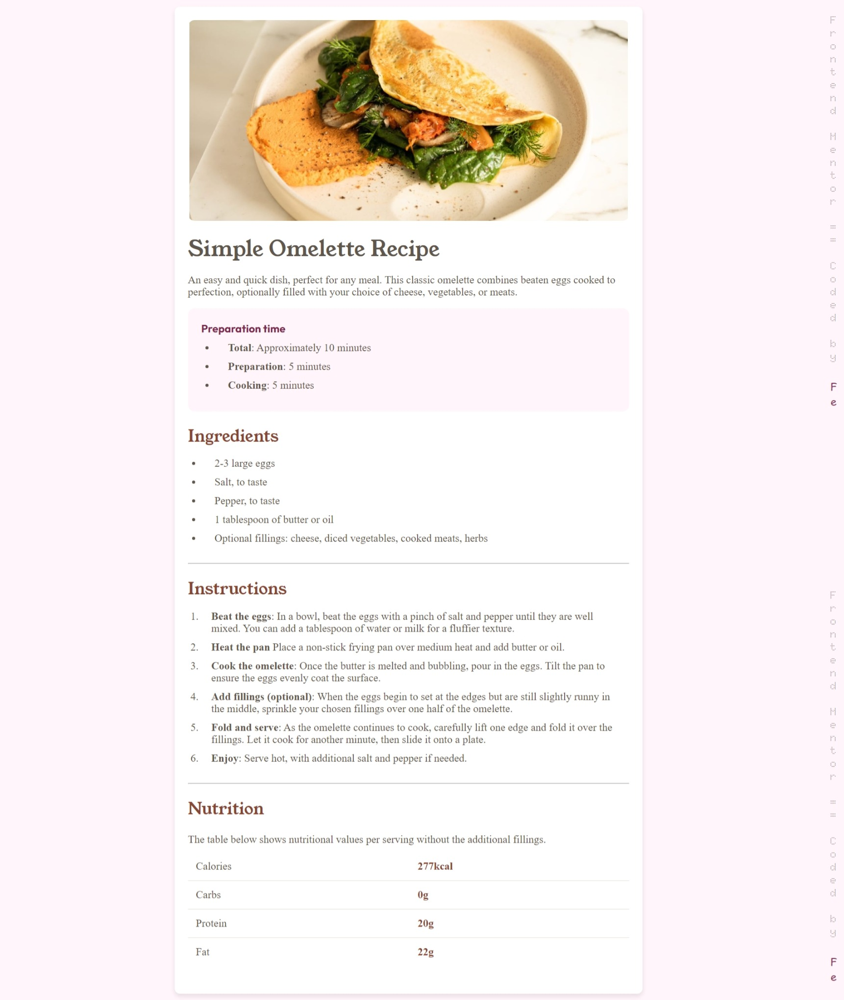
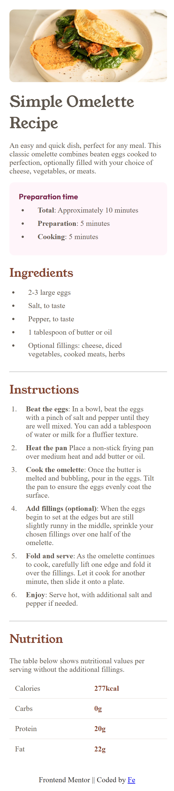

# Frontend Mentor - Recipe page

This is the solution to the [the Recipe page coding challenge on Frontend Mentor](https://www.frontendmentor.io/challenges/recipe-page-KiTsR8QQKm/hub) Coded By [Fe](feyselteshome05@gmail.com).

## Table of contents

- [Overview](#overview)
  - [The challenge](#the-challenge)
  - [Screenshot](#screenshot)
  - [Links](#links)
- [Author](#author)
- [Acknowledgments](#acknowledgments)

## Overview

### The challenge

- Building out this recipe page and get it looking as close to the design as possible.

### Screenshot

#### Desktop Design

### Mobile Design

### Links

- Solution URL: [Github Repo](https://github.com/Code-Me-Well/Recipe-Page-Main?tab=readme-ov-file)
- Live Site URL: [Vercel Site](https://recipe-page-main-umber.vercel.app/)

## Author

- Frontend Mentor - [@Code-Me-Well](https://www.frontendmentor.io/profile/Code-Me-Well)

## Acknowledgments

This project was completed in just a few hours. Great job, me! [Me](https://github.com/Code-Me-Well).